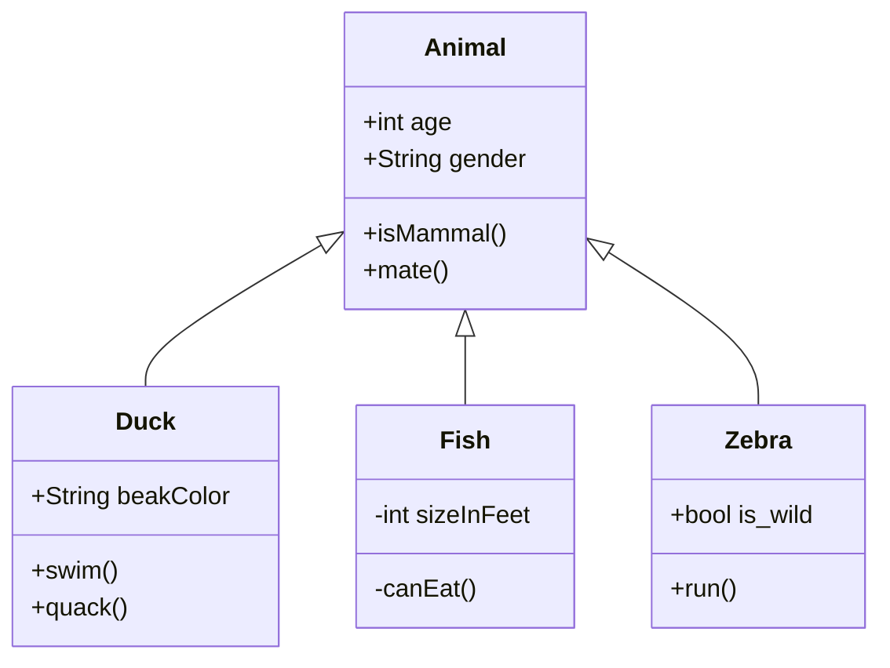

In the WYSIWYG editor, you can write Mermaid code. Currently the preview of Mermaid diagrams is not available directly in the editor, but you can view the result on the mobile app or the preview. To get a real-time preview of you diagrams, use the [online editor providedd by Mermaid](https://mermaid.live/edit).

## Basic syntax
To insert a Mermaid diagram, use a dedicated code block with the following syntax: 

<pre>
```mermaid
Your mermaid code here
```
</pre>

## Diagram example

<pre>

</pre>
