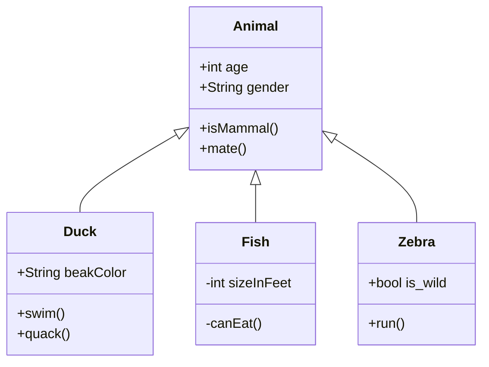

Dans l'éditeur WYSIWYG, vous pouvez rédiger du code Mermaid. Actuellement, l'aperçu des diagrammes Mermaid n'est pas disponible directement dans l'éditeur, mais vous pouvez visualiser le résultat sur l'application mobile ou l'aperçu. Pour obtenir un aperçu en temps réel de vos diagrammes, utilisez [l'éditeur en ligne proposé par Mermaid](https://mermaid.live/edit).

## Syntaxe de base

Pour insérer un diagramme Mermaid, utilisez une balise de code dédiée avec la syntaxe suivante : 

<pre>
```mermaid
Votre code mermaid ici
```
</pre>

## Exemple de diagramme

<pre>

</pre>
