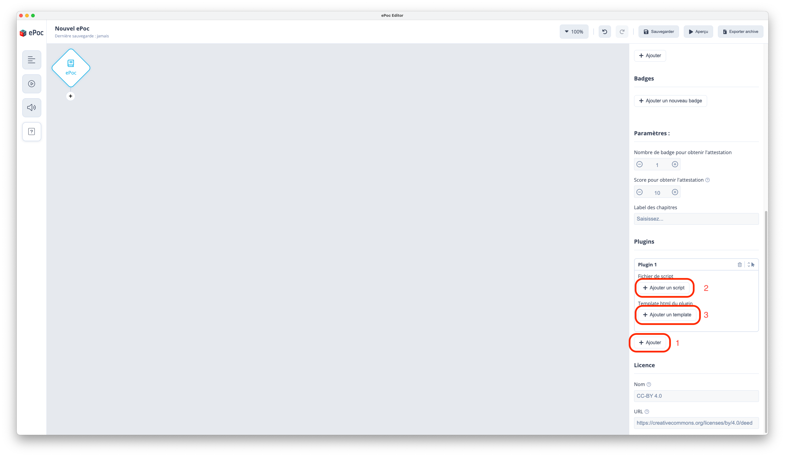
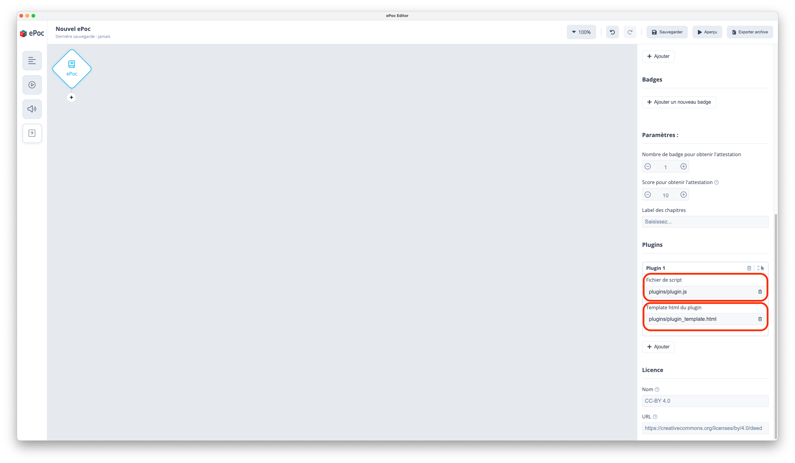
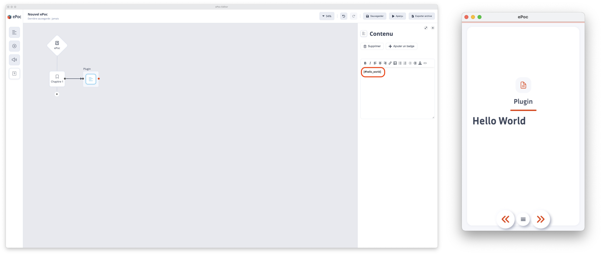
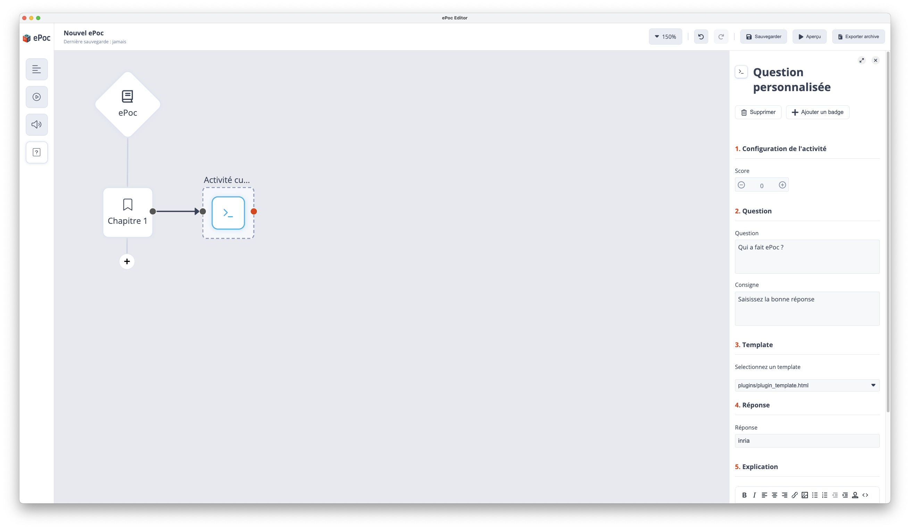
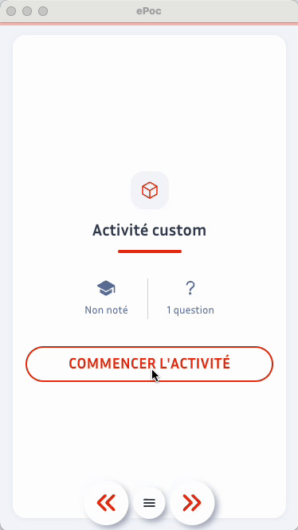

# Utiliser un plugin

Ce guide vous montrera comment utiliser un plugin JavaScript dans un ePoc.

## Installer un plugin

1. [Créer](create.md) ou télécharger les fichiers d'un plugin
2. Ajouter un plugin dans les paramètres de l'ePoc
3. Ajouter le fichier javascript du plugin (obligatoire)
4. Ajouter le fichier template du plugin (optionnel)



## Intégrer un template

### Intégrer dans une page de texte

Si votre plugin déclare un template vous pouvez ensuite l'intégrer à l'aide du shortcode prédéterminé.

**Exemple :** En repartant de l'[exemple "Hello World"](create.md#exemple-hello-world) du guide de création d'un plugin

```js
// plugin.js

ePoc.onLoad = () => {
    // Executé lorsque le plugin est chargé à l'ouverture de l'ePoc
    console.log('Hello World')
    
    // Le plugin retourne le nom du template et le shortcode pour l'intégrer dans les pages de texte
    return {
        template: 'plugin_template.html',
        shortcode: '[#hello_world]' // Shortcode à définir ici
    };
}
```

```html
<!-- plugin_template.html -->

<html lang="en">
<head>
    <!-- Feuille de style pour avoir un affichage identique à l'app mobile -->
    <link rel="stylesheet" href="/assets/css/plugin-embed.css">
</head>
<body>
<h1>Hello World</h1>
<!-- Script pour avoir accès à l'API -->
<script src="/assets/js/plugin-api-embed.js"></script>
<script>
    // Votre logique métier ici
</script>
</body>
</html>
```





### Intégrer dans un quiz

Si votre plugin déclare un template vous pouvez aussi l'intégrer dans une question personnalisée.

**Exemple :** En repartant de l'[exemple "Question personnalisée"](create.md#exemple-de-question-personnalisée) du guide de création d'un plugin

```js
// plugin.js

ePoc.onLoad = () => {
    // Executé lorsque le plugin est chargé à l'ouverture de l'ePoc
    console.log('Hello World')
    
    // Le plugin retourne le nom du template et le shortcode pour l'intégrer dans les pages de texte
    return {
        template: 'plugin_template.html',
        shortcode: '[#hello_world]' // Shortcode à définir ici
    };
}
```

```html
<!-- plugin_template.html -->
<!-- Question personnalisée champ texte libre -->
<html lang="en">
<head>
    <link rel="stylesheet" href="/assets/css/plugin-embed.css">
</head>
<body>
<form>
    <!-- Champ texte -->
    <input type="text"/>
</form>
<script src="/assets/js/plugin-api-embed.js"></script>
<script>
    const userInput = document.querySelector('input');
    // Quand l'utilisateur tape du texte
    userInput.addEventListener('keyup', (event) => {
        // On envoie la réponse à l'app
        plugin.emit('user-responded', userInput.value)
    });
</script>
</body>
```



Ce qui donne comme résultat :
  


