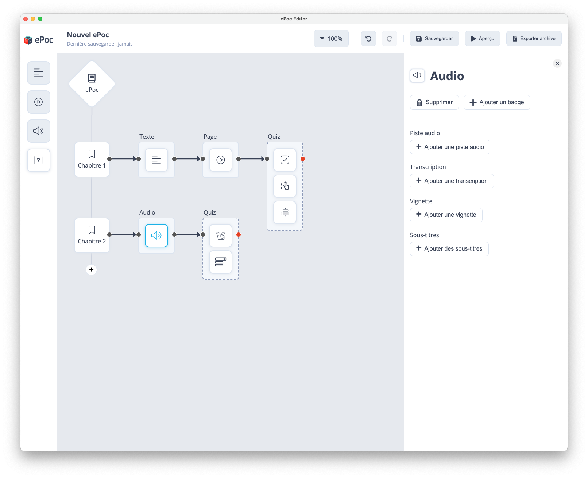

# Contenu Audio

Pour intégrer un contenu audio à votre parcours de formation, il faut effectuer un glisser-déposer en partant de l’icône
audio dans la barre d'outils latérale et le déposer dans la zone d'édition.

Séquences audio enregistrées qui peuvent inclure de la musique, des podcasts ou des effets sonores. Ce contenu peut être utilisé pour fournir des commentaires, des instructions ou des explications sur un sujet spécifique, ou pour permettre aux utilisateurs d'écouter des enregistrements de conférences ou de séminaires par exemple.

Les informations à renseigner pour la rubrique “audio“ sont :

- Ajouter un audio : importer le fichier audio dans l'éditeur ePoc en utilisant le bouton "Ajouter une audio".
- Résumé : brève description de l'audio pour aider les utilisateurs à comprendre son contenu.
- Transcription : si l'audio contient un discours ou un dialogue important, vous pouvez fournir une transcription textuelle de l'audio pour aider les utilisateurs qui ne souhaite pas ou qui ne sont pas en capacité d'écouter l'audio.

