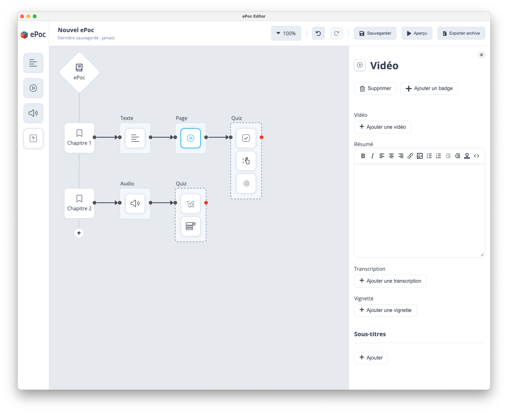

# Contenu Vidéo

Pour intégrer un contenu vidéo à votre parcours de formation, il faut effectuer un glisser-déposer en partant de l’icône 
vidéo dans la barre d'outils latérale et le déposer dans la zone d'édition.

Séquences vidéo enregistrées qui peuvent inclure des images, du son et des animations. Ce contenu peut être utilisé pour fournir des démonstrations, des présentations, des interviews ou des explications sur un sujet spécifique.

Les informations à renseigner pour la rubrique “vidéo“ sont :
    
- Ajouter une vidéo : importer la vidéo dans l'éditeur ePoc en utilisant le bouton "Ajouter une vidéo".
- Résumé : brève description de la vidéo pour aider les utilisateurs à comprendre son contenu.
- Transcription : si la vidéo contient un discours ou un dialogue important, vous pouvez fournir une transcription textuelle de la vidéo pour aider les utilisateurs qui ne souhaitent pas ou qui ne sont pas en capacité d'écouter la vidéo avec du son.
- Vignette : image miniature pour la vidéo pour aider les utilisateurs à identifier la vidéo et à la sélectionner facilement.
- Sous-titres : si la vidéo contient des dialogues ou des discours importants, vous devez fournir des sous-titres pour aider les utilisateurs qui ont des problèmes d'audition ou qui regardent la vidéo dans un environnement bruyant où le son peut être difficile à entendre.



## Encodage des videos

Pour garantir une lecture optimale des vidéos sur la plupart des smartphones, nous recommandons l'encodage en format MP4 avec le codec H.264 en résolution 480p. Ce format est suffisant pour une lecture fluide et de bonne qualité sur les appareils mobiles.

### Encodage avec ffmpeg

Pour encoder une ou plusieurs vidéos avec [ffmpeg](https://www.ffmpeg.org/), utilisez les commandes suivantes :

```sh
# Encodage d'une vidéo ou "video.mp4" est la vidéo d'origine et "video-min.mp4" est la vidéo compressée
ffmpeg -i video.mp4 -s hd480 -c:v libx264 -crf 23 -c:a aac -strict -2 "video-min.mp4"

# Encodage de toutes les videos d'un dossier
for file in $(find . -name "*.mp4" | sort -z); do
    ffmpeg -i "${file}" -s hd480 -c:v libx264 -crf 23 -c:a aac -strict -2 "${file%.*}-min.mp4"
done
```

### Encodage avec Handbrake

Si vous préférez utiliser un logiciel graphique nous vous recommandons [HandBrake](https://handbrake.fr/rotation.php?file=HandBrake-1.9.0.dmg). Pour ce faire, suivez ces étapes :

1. Ouvrez HandBrake et chargez votre fichier vidéo. 
2. Sélectionnez le préréglage "HQ 480p30". 
3. Assurez-vous que le format de sortie est MP4 et que le codec vidéo est H.264. 
4. Choisissez un emplacement et un nom de sortie pour la vidéo
5. Cliquez sur "Démarrer" pour commencer l'encodage.

Ces recommandations garantissent une compatibilité maximale et une qualité optimale pour la lecture sur divers appareils.
