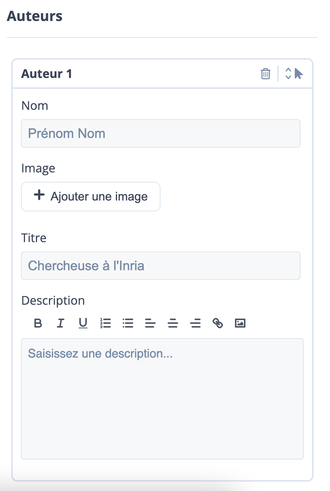

# Paramètres ePoc

Créer un ePoc nécessite de renseigner quelques paramètres dans un formulaire (situé dans la partie droite de l’écran) afin de personnaliser certains aspects de la formation. Pour accéder à la fenêtre “A propos de l’ePoc”, il faut cliquer sur l’icône ePoc (situé en haut à gauche) de la partie centrale. Vous remarquerez que lorsque l’icône est sélectionnée, ses contours deviennent bleus.

Dans le formulaire (la partie droite de l’écran) les paramètres sont classés dans différentes rubriques :

## Metadonnées

- ID de l’ePoc : le numéro de référencement de l’ePoc.
- Edition : l’année de publication de l’ePoc.
- Titre : le nom complet de la formation sur mobile (conseil : éviter de choisir un titre trop long)
- Image de couverture : l’image utilisée pour représenter la formation ePoc. Elle est souvent la première image que les utilisateurs voient et doit être “accrocheuse” pour susciter de l'intérêt.
- Teaser vidéo : la courte vidéo qui donne un aperçu du contenu de la ressource ePoc. Elle peut contenir des interviews, des graphiques, des animations etc, pour attirer l'attention des utilisateurs et leur donner un avant-goût de ce qu'ils peuvent attendre de la ressource.
- Vignette de la vidéo : l’image miniature souvent utilisée pour donner un aperçu de ce que la vidéo contient et pour inciter les utilisateurs à cliquer sur la vidéo pour la regarder.
- Présentation : la description détaillée de la ressource elle-même, de son contenu, des thématiques abordées.

## Auteurs

- Auteurs : les personnes qui ont créé la formation ePoc.

Les informations à renseigner pour la rubrique “auteurs“ sont :

- Le nom et prénom de l’auteur
- Une éventuelle photo ou un avatar de l’auteur
- Titre : son identité professionnelle (enseignant, formateur, ingénieur pédagogique, spécialistes du contenu ou d'autres professionnels de l'éducation).
- Description : préciser quel a été son rôle au cours de la création de l’ePoc (exemple : conception et scénarisation de la formation)

## Objectifs

Permettent de décrire ce que les utilisateurs peuvent attendre de la formation en suivant la formation sur mobile. Les objectifs peuvent être spécifiques ou généraux et peuvent être liés à des compétences, des connaissances ou des aptitudes particulières.

## Paramètres généraux de l'ePoc

- **Label des chapitres** : un court titre utilisé pour identifier chaque section de la ressource ePoc. Il est possible de modifier le nom “chapitre” en utilisant la barre de complétion. (exemples : scénario, module, etc)