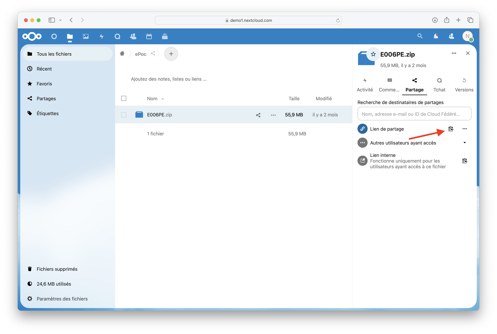
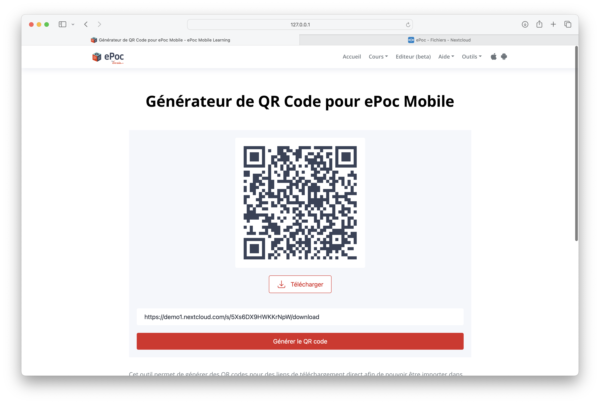
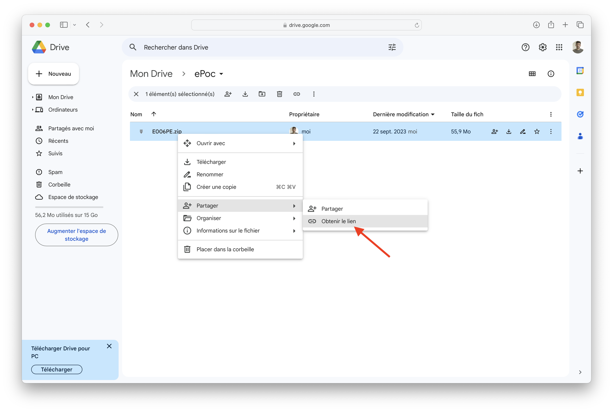
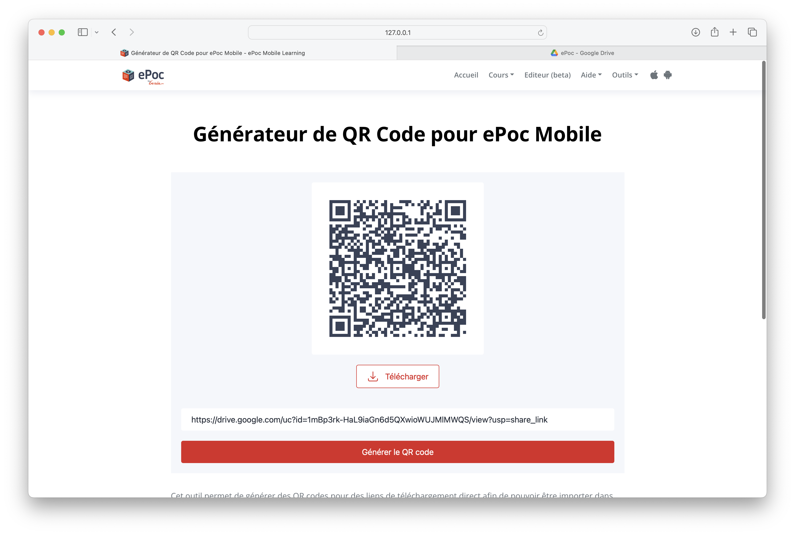
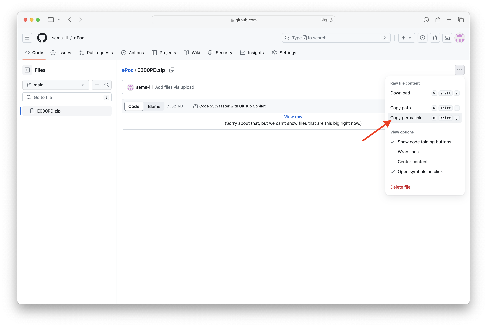
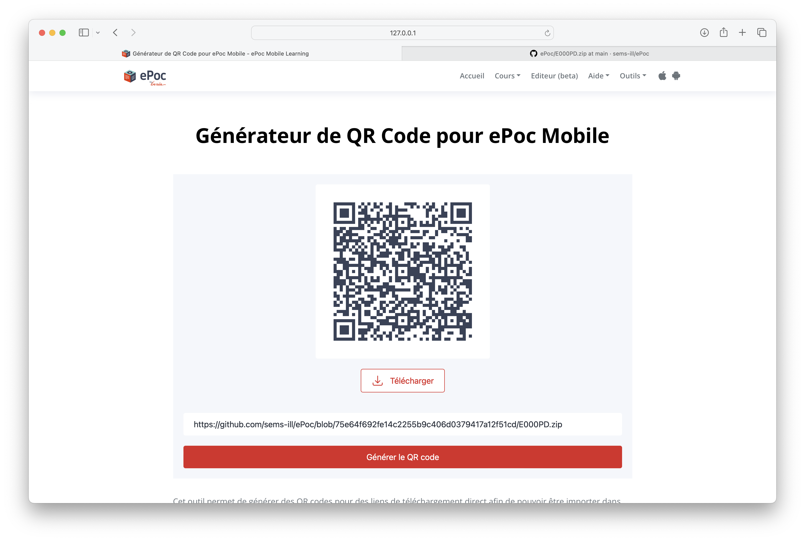
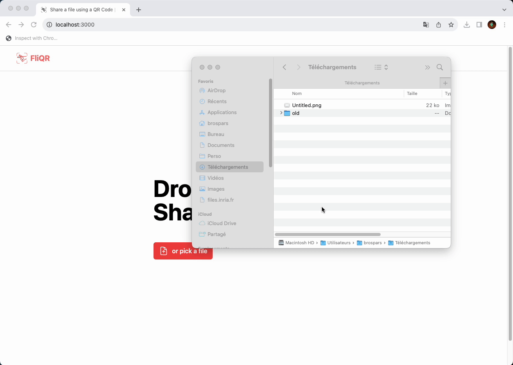

# Publier et partager

## Publier votre ePoc

Une fois votre ePoc terminé, vous pouvez le publier sous forme d'archive lisible par notre application mobile.

Pour cela rien de plus simple :

1. Cliquer sur le bouton d'export en haut à droite
2. Choisisez un emplacement et un nom de fichier

## Partager votre ePoc

Afin de pouvoir consulter votre nouvel ePoc dans l'application mobile, vous devez l'héberger sur un service accessible
depuis internet (Nuage, Nextcloud, Google Drive, Dropbox, Github, etc).

Une fois celui-ci déposer vous pouvez générer un QR Code avec [notre outil](../../qr-code-generator/index.md) en ligne pour l'importer depuis votre application mobile.

### Déposer sur Nextcloud/Nuage

Nuage est le cloud (propulsé par Nextcloud) et proposé à tous les agents de l'éducation nationnale mais vous pouvez aussi une liste de 
fournisseur basé sur Nextcloud [ici](https://www.chatons.org/search/by-service?service_type_target_id=All&field_alternatives_aux_services_target_id=554&field_software_target_id=All&field_is_shared_value=All&title=).

1. Déposer votre ePoc dans votre espace
2. Récuperer le lien de partage et ajouter `/download` à la fin  
    Exemple : `https://demo1.nextcloud.com/s/5Xs6DX9HWKKrNpW`  
    Devient : `https://demo1.nextcloud.com/s/5Xs6DX9HWKKrNpW/download`
3. Utiliser [notre outil](../../qr-code-generator/index.md) pour convertir ce lien en QR Code

### Déposer sur Google Drive

1. Déposer votre ePoc dans votre espace (100MB max sinon Google Drive affiche un avertissement qui bloque le téléchargement direct)
2. Récuperer le lien de partage
3. Utiliser [notre outil](../../qr-code-generator/index.md) pour convertir ce lien en QR Code

### Déposer sur Github

1. Déposer votre ePoc dans votre dépôt (25MB max, le dépôt doit être *public*)
2. Copier le lien vers le fichier
3. Utiliser [notre outil](../../qr-code-generator/index.md) pour convertir ce lien en QR Code

### Déposer sur Dropbox

1. Déposer votre ePoc dans votre espace
2. Récupérer le lien de partage
3. Utiliser [notre outil](../../qr-code-generator/index.md) pour convertir ce lien en QR Code

### Partage rapide sur FliQR

Pour un partage rapide (QR code valable que quelques jours) vous pouvez déposer votre ePoc sur [FliQR](https://fliqr.codes). Ce service propose une version gratuite idéale pour partager un ePoc en cours de conception.

1. Déposer votre ePoc sur le site [FliQR.codes](https://fliqr.codes)
2. Récupérer le QR Code

