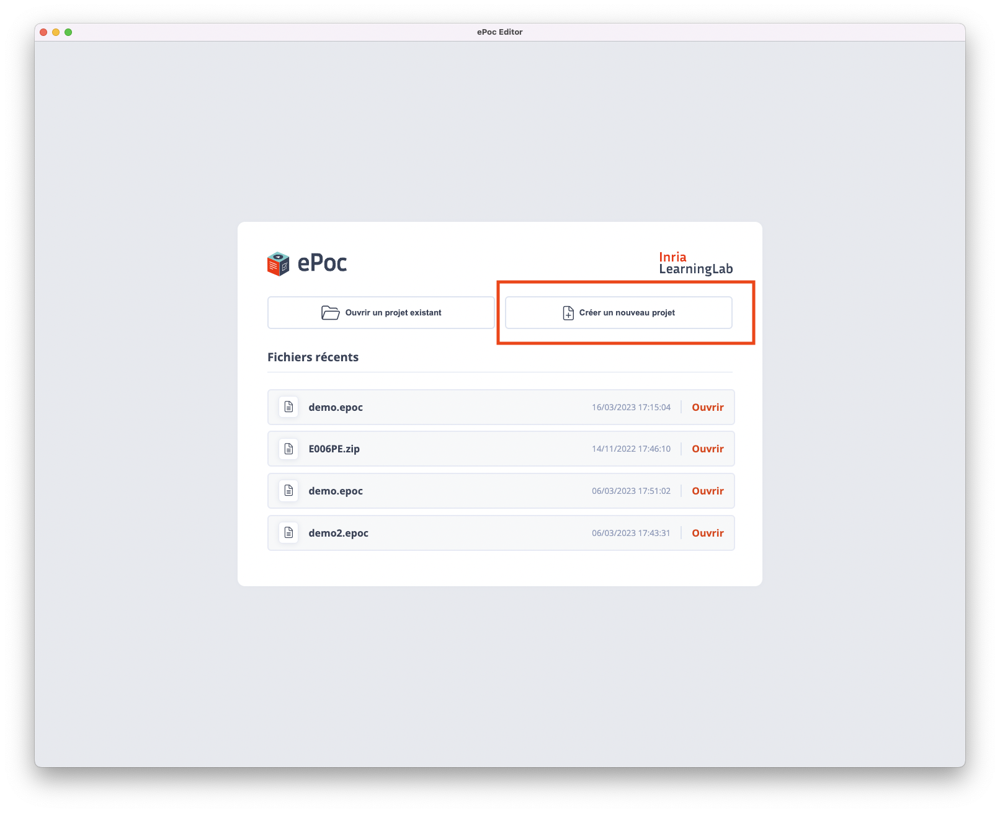
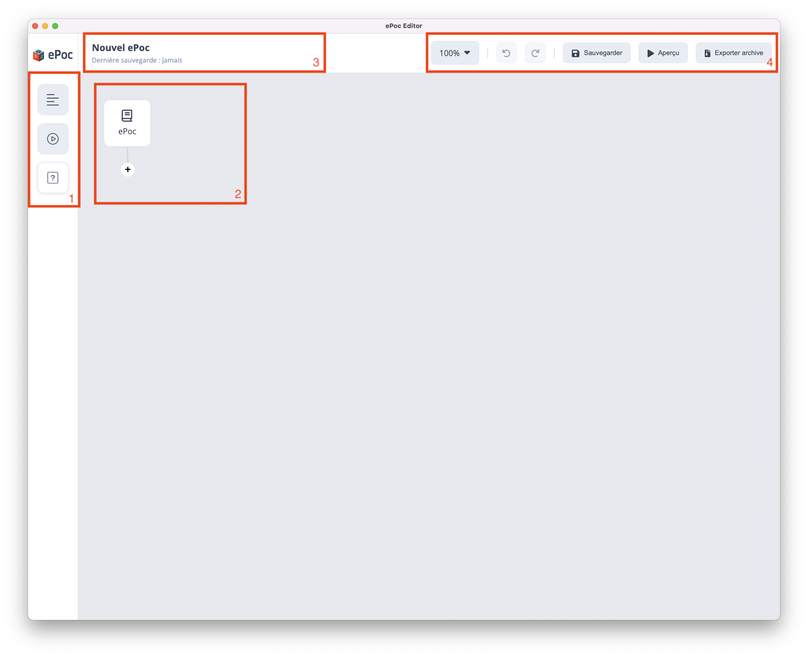

# Démarrage

## Démarrer un nouveau projet

Une fois l'éditeur ePoc lancé, démarrer la création d'une formation, en cliquant sur le bouton de droite "Créer un nouveau projet" :

Par défaut, vous accédez à une interface de départ qui se compose de différents éléments. Voici une description de ces éléments :

1. Barre d’outils latérale pour ajouter les contenus à votre scénario en glisser/déposer ([en savoir plus](content/text.md)).

2. Zone d'édition est la partie centrale pour la construction du scénario pédagogique.

3. Barre de statut (en haut à gauche) qui donne des informations sur l'ePoc en cours d'édition

4. Barre d'accès rapide (en haut à droite) qui permet d'accéder rapidement à certaines fonctionnalités de l'éditeur, telles que :
    - Zoom : zoomer sur le scénario pédagogique afin de mieux visualiser les différentes branches et sous-branches de la formation. Très utile lorsque vous travaillez sur des formations complexes avec plusieurs embranchements. Vous pouvez aussi zoomer en utilisant la molette de votre souris.
    - Retour en arrière : annuler la dernière action effectuée dans l'éditeur. Vous pouvez cliquer sur cette fonctionnalité plusieurs fois de suite. 
    - Revenir en avant : rétablir la dernière action annulée dans l'éditeur. Vous pouvez cliquer sur cette fonctionnalité plusieurs fois aussi. 
    - Sauvegarder : sauvegarder toutes les modifications que vous avez apportées à votre projet. Il est important de sauvegarder régulièrement votre projet pour éviter de perdre des données en cas de panne d'ordinateur ou de coupure de courant.
    - Aperçu : prévisualiser votre formation telle qu'elle apparaitra pour les apprenants, sur mobile. Vous pouvez utiliser cette fonctionnalité pour vous assurer que votre formation est bien structurée et que tous les éléments interactifs fonctionnent correctement. 
    - Exporter archive : exporter votre formation sous forme d'une archive qui peut être téléchargée et partagée avec d'autres utilisateurs. Cette archive contient toutes les données et les fichiers nécessaires pour être lue sur l'[application mobile ePoc](http://epoc.inria.fr), y compris les images, les vidéos, les quiz, etc.

## Terminologie

Dans ce guide nous ferons la distinction des termes suivants :

- Page : un élément qui compose un chapitre. Une page contient un titre et un ou plusieurs contenus disposés verticalement. 
  On peut passer d'une page à l'autre en swipant de droite à gauche
- Contenu : un élément qui compose une page. Un contenu peut être du texte, des images, des tableaux, des graphiques et d'autres éléments de contenu.
