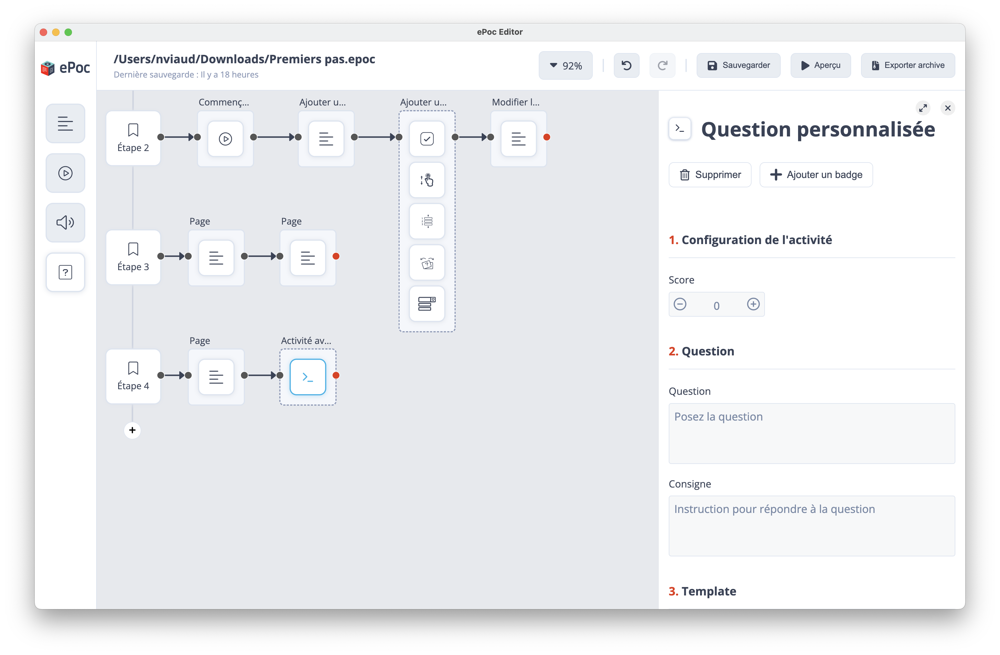

# Question personnalisée
Une question personnalisée permet de créer une question avec un contenu spécifique à partir d'un fichier HTML.

Ces questions sont gérées à travers le système de plugins.

## Création du plugin

### Création du fichier de script
Pour commencer, nous allons créer notre fichier de script, celui est assez simple dans le cas des questions personnalisées.
Dans ce fichier, nous allons renseigner un short code qui sera l'identifiant de notre plugins, ainsi que le nom de notre template HTML.
```js
ePoc.onLoad = (context) => {
    return {
        shortcode: '[#custom_question]',
        template: 'template.html'
    }
}
```

### Création du template HTML
Ensuite, nous allons créer notre template HTML, celui-ci contiendra le contenu, ainsi que la logique de notre question.
On commence par ouvrir une balise html ainsi que le "head" et le "body".
```html
<html>
    <head></head>
    <body></body>
</html>
```

Nous continuons par ajouter une balise "script" pour importer l'API "plugin-embed", cette API nous donne accès à un objet "plugin" (c'est cet objet qui nous permet de communiquer avec l'application).
Vous pouvez également importer une feuille de style CSS fourni pour les plugins pour garder une cohérence visuelle avec le reste de l'application.
```html
<html>
    <head>
        <link rel="stylesheet" href="/assets/css/plugin-embed.css" />
    </head>
    <body>
        <script src="/assets/js/plugin-api-embed.js"></script>
    </body>
</html>
```

Ensuite, on ajoute le contenu de notre question, par exemple un champ de saisie :
```html
<html>
    <head>
        <link rel="stylesheet" href="/assets/css/plugin-embed.css" />
    </head>
    <body>
        <input type="text" class="answer-input">
        
        <script src="/assets/js/plugin-api-embed.js"></script>
    </body>
</html>
```

Enfin, on ajoute un nouveau script, qui contiendra la logique de notre question.
```html
<html>
    <head>
        <link rel="stylesheet" href="/assets/css/plugin-embed.css" />
    </head>
    <body>
        <input type="text" class="answer-input">
        
        <script src="/assets/js/plugin-api-embed.js"></script>
        <script>
            // On récupère notre champ de saisie précédemment créé
            const answerInput = document.querySelector(".answer-input");
            
            // On écoute les modifications sur ce champs pour détecter les réponses de l'utilisateur
            answerInput.addEventListener("change", (event) => {
                
                // On informe l'application que l'utilisateur a répondu à la question, en utilisant la valeur saisie
                plugin.emit("user-responded", answerInput.value);
            });
        </script>
    </body>
</html>
```

### Ajout du plugin dans l'éditeur

Pour ajouter notre plugin dans l'éditeur, il faut se rendre dans le formulaire du noeud ePoc, puis cliquer sur "Ajouter un plugin".
On peut maintenant choisir notre fichier de script, ainsi que notre template HTML dans les champs correspondants.

Ensuite, dans le formulaire de la question personnalisée, on pourra choisir le template que l'on a ajouté précédemment.

Une caractéristique distinctive de ces questions est que la bonne réponse est stockée sous la forme d'une variable, que l'on peut spécifier dans le champ réponse du formulaire.
La question sera donc réussi si la dernière valeur entrée par l'utilisateur avant d'appuyer sur le bouton "VALIDER" est égale à la valeur de la variable réponse.