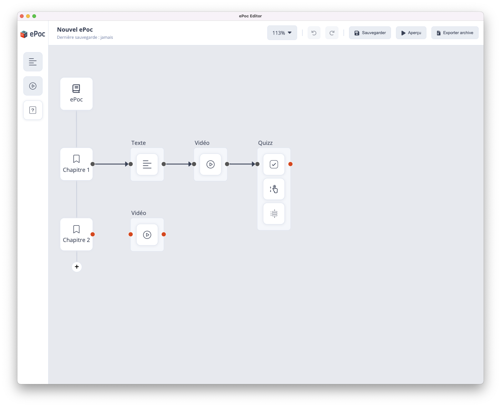
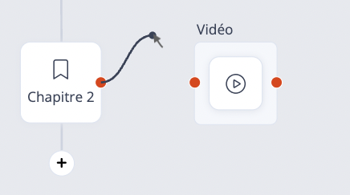

# Former votre scénario

La particularité de cet éditeur est que l’interface graphique proposée se veut très visuelle. L'ePoc est composé de chapitres qui sont eux-mêmes composés de pages qui contiennent différents types de contenus (vidéo, textes, quiz, etc).

## Relier les pages

Les chapitres disposent d’un point rouge et les pages, de deux points rouges de chaque côté. Ces points rouges permettent de connecter les pages entre elles et à un chapitre, selon le parcours pédagogique pour les intégrer à la formation sur mobile. 

!!! warning "Attention"
    Il est en impossible de prévisualiser des contenus non-connectés

Pour relier deux pages existants, placer votre curseur de souris sur le point rouge à côté du premier contenu et maintenez le bouton de la souris enfoncé. Faites glisser votre souris jusqu’à l’autre point rouge du deuxième contenu et relâchez le bouton de la souris. Une flèche noire reliant les deux contenus apparaîtra.

N'hésitez pas à explorer les fonctionnalités de cet outil pour créer des formations interactives et engageantes !

## Action sur la zone d'édition

- Ajouter un élément : Glisser déposer un élément depuis la barre d'outils latérale.
- Supprimer un élément
    - Sélectionner un contenu ou une page et cliquer sur le bouton pour le supprimer.
    - Utiliser la touche “effacer” de votre clavier.
- Déplacer un élément : cliquer en restant enfoncé et déplacer la souris pour le déplacer, puis relâcher.
- Selection multiple :
    - Maintenir la touche “majuscule” de votre clavier pour créer un rectangle de sélection de plusieurs éléments
    - Maintenir la touche "ctrl/cmd" de votre clavier puis cliquer sur les élements que vous souhaitez sélectionner