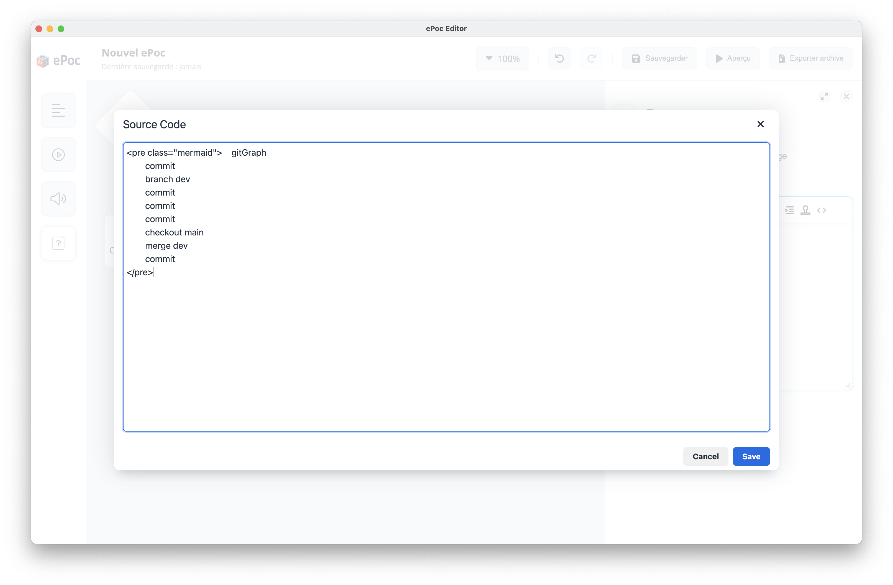

# Intégration Mermaid
Dans l'éditeur WYSIWYG, vous avez la possibilité de rédiger du code Mermaid pour générer des diagrammes.

Pour créer ce code Mermaid, vous pouvez utiliser l'éditeur Mermaid disponible ici : (TODO : Ajouter le lien ici). Cet éditeur vous permet d'écrire et de visualiser votre diagramme.

Une fois votre diagramme créé, vous pouvez cliquer sur le bouton « Copier le code » situé sous l'aperçu du graphique. Pour intégrer votre diagramme dans votre parcours, il suffit de coller ce code dans la section « Source Code » de l'éditeur WYSIWYG.

Pour le moment, la prévisualisation du diagramme n'est pas disponible directement dans l'éditeur WYSIWYG, mais vous pouvez en voir le rendu final en lançant l'aperçu.

